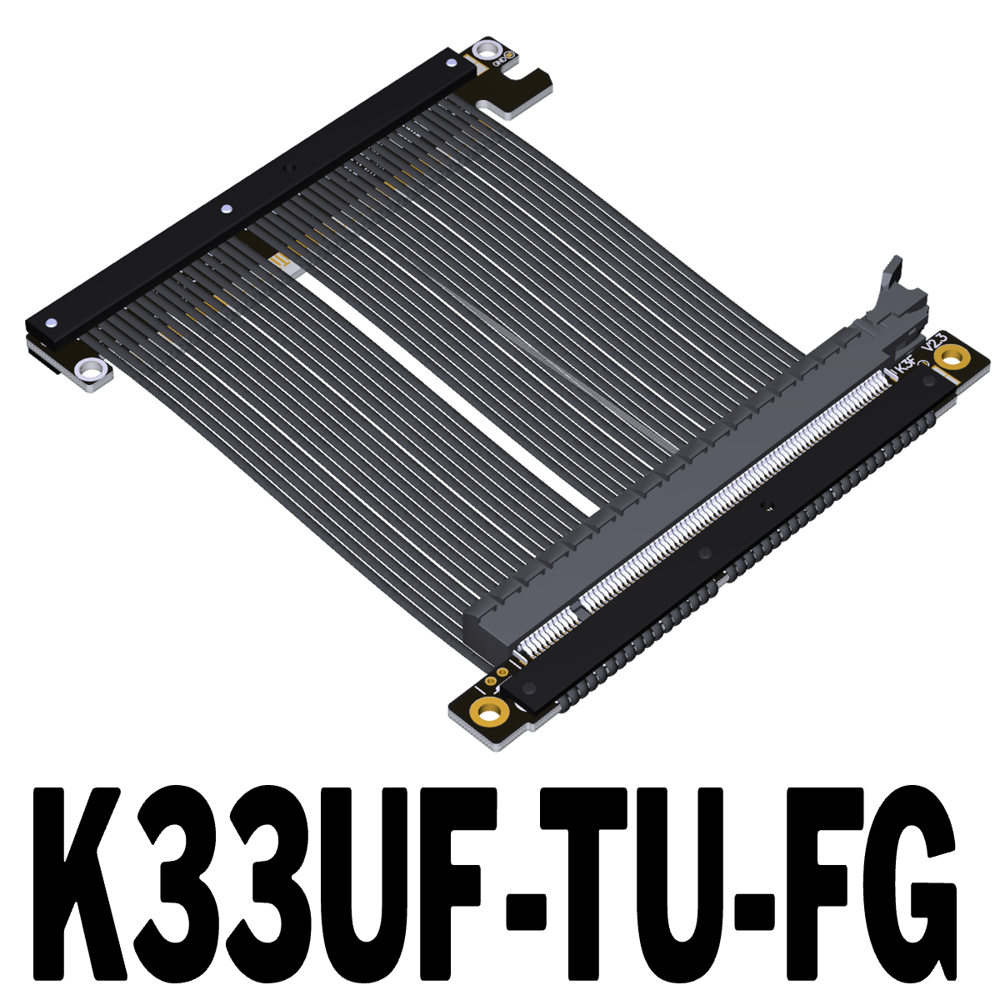
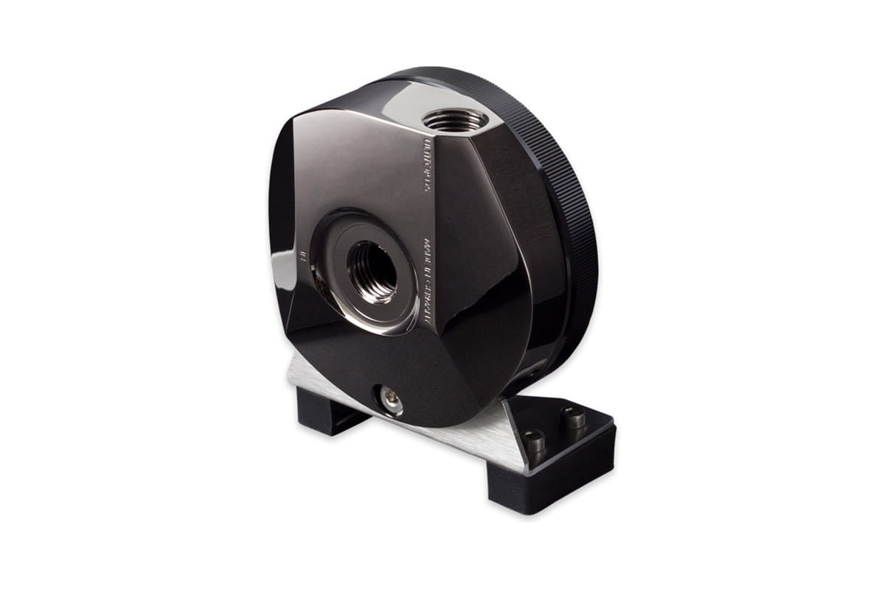
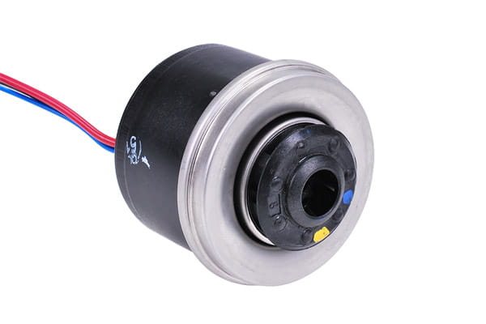

# Compute Sled

Frame to hold motherboard, water pump, and GPU.

## Fasteners
* 2x 6mm M3 screws [PCIe riser] // TODO CHECK
* 4x 6mm M3 screws [Pump bracket]
* 4x 6mm tall M3 male-female threaded standoffs [Motherboard mounting]
* 2x 6mm M4 screws [GPU card to bracket]
* 6x 12mm M4 screws [GPU bracket mounting]
* 12x 12mm M6 screws [10x for mounting plate brackets, 2x GPU support block]

## PCIe extension

ADT-Link K33UF-TU-FG

PCI-E 5.0 x16 to x16 turn 180 degree splint vertical extension cable

175-180mm length is ideal when used with 6mm thick acrylic.

## Pump

### Pump top with mounting bracket

Aquacomputer ULTITOP D5 MIRROR BLACK pump adapter for D5 pumps, G1/4

### Pump

Alphacool VPP655

## GPU

Reference GPU is the RTX 5090 TUF with the Alphacool Core GeForce RTX 5090 TUF Gaming GPU Water Block.

