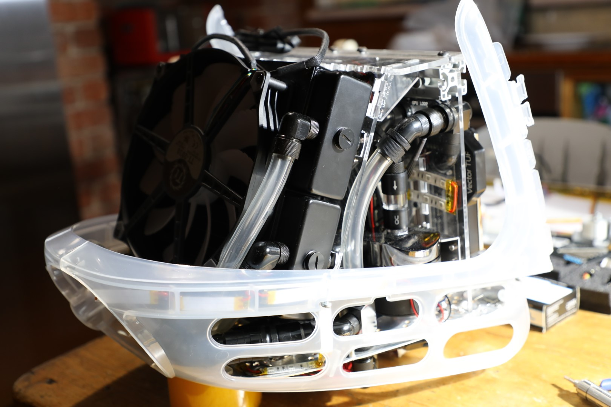
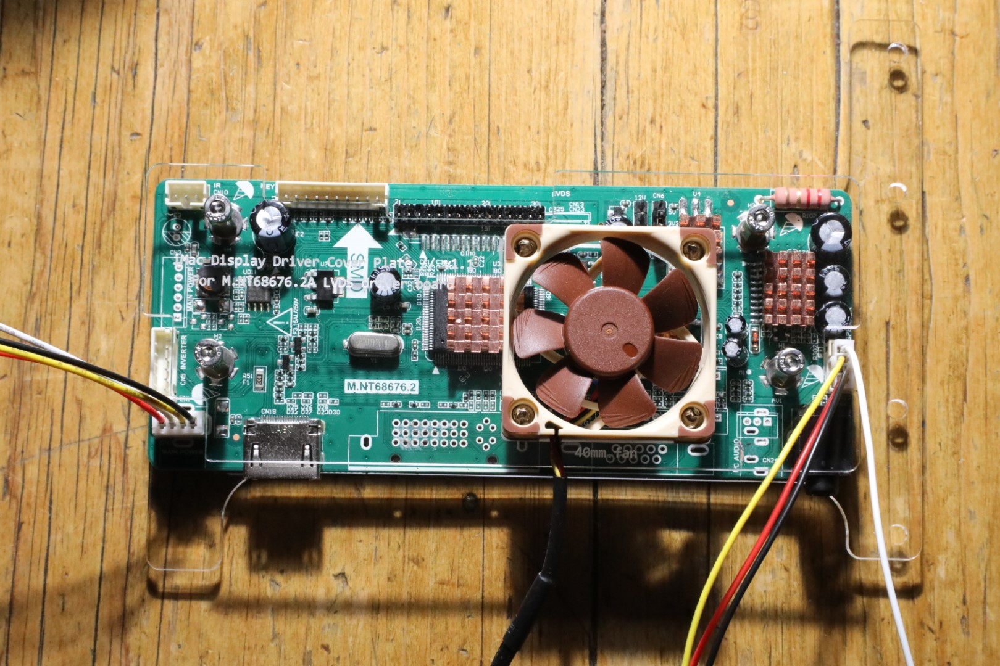
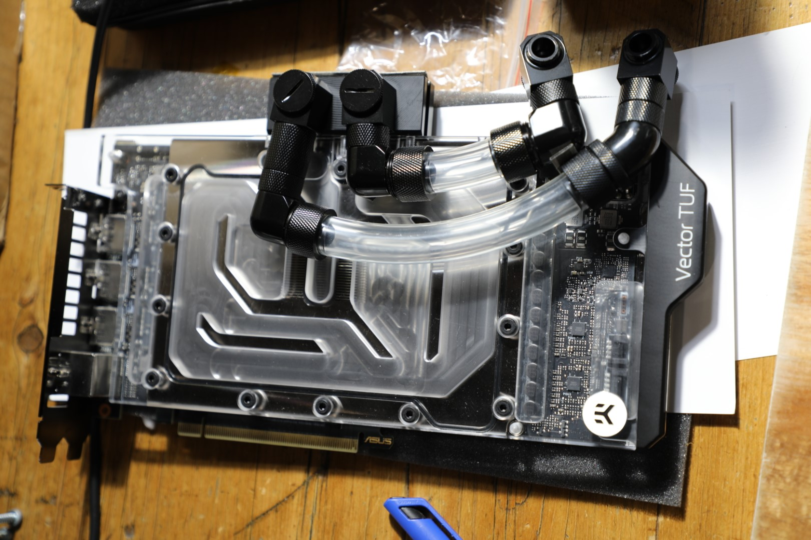
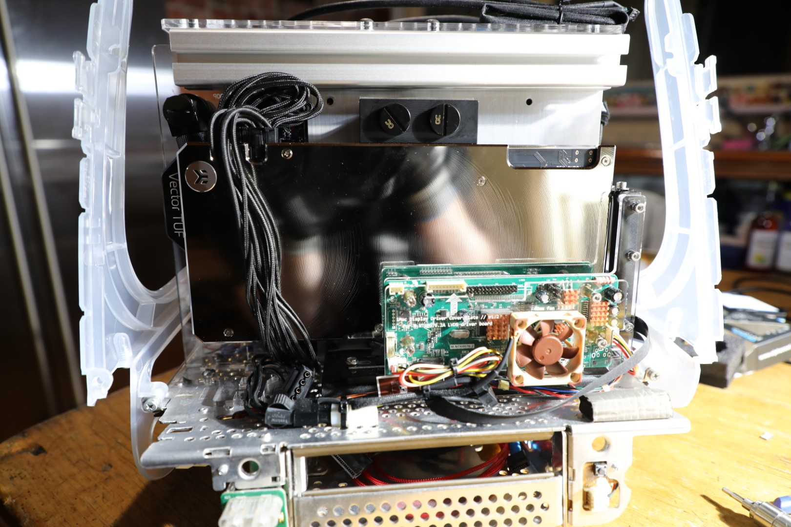

# iMac G3 Gaming PC Conversion

Parts and instructions to convert an iMac G3 into a powerful, modern gaming PC.

## About

This is a project to convert a year ~2000 Apple iMac G3 DV (slot load, Graphite) computer into a fully fledged gaming PC, to serve as a portable LAN box and VR machine.

The donor iMac was broken and completely missing the actual compute unit, so no working iMacs were harmed in the making of this monstrosity.

This concept certainly isn't new, but I'm hoping to set this project apart by reducing the amount of destructive case modifications, and packing in significantly more power, hopefully without melting everything. This will be accomplished by using 3D printed and laser cut acrylic brackets, and a healthy amount of water cooling.

The project is still in-progress, but should eventually become an instructional kit for reproducing the mod.

## Project Status

### TODO

* Final laser cut parts for radiator mounting
* Additional brackets for case reinforcements
* Fan shroud to direct air through rear vent
* Slot loading BD drive bracket
* Case front panel wiring
* Side panel for IO extensions
* Final assembly
* Water loop filling
* First boot (hopefully before all the parts are totally obsolete!)

### What's complete

* All parts mounted in their final locations
* Custom water loop is complete and pressure tested (0.5 bar / 15 mins)
* PSU is patched to 240V plug on case (original location)
* PSU is wired to mobo, GPU, water pump and display
* UV LEDs placed and wired up to 12V RGB motherboard header

### Previous similar projects

Recently I discovered another iMac casemod project \([hackaday](https://hackaday.io/project/160719-imac-g3-casemod), [github repo here](https://github.com/Diepzeevogel/iMac-G3-replacement-parts)\). This includes many similar ideas, although the mounting locations are very different. None of the parts are directly usable but provide some good hints for layout.

## Overview of replacement components

### Display

HYDIS HV150UX2-100. It is a 15" LCD LVDS laptop display, that is UXGA (1600x1200), 4:3, and LED backlit. It's a slightly more expensive upgrade to the HV150UX1, which is CCFL backlit. 

The screen is almost a perfect fit for the iMac G3 stock display bezel, except the corners are slightly cut off by the curved edges. However, it's pretty close, and at this size and resolution I have not found a better display for the project, especially since this one has a display controller cheaply available on eBay.

It is held in via 4 3D printed nylon mounting brackets, which fit over the original CRT mounting holes:

### Display adapter board

The HYDIS display is powered by a M.NT68676.2A.11486 LVDS controller board, which accepts HDMI and 12V power and outputs the display LVDS signal and backlight control.

The M.NT68676.2A.11486 is readily available on eBay as a drop-in controller for the HV150UX1, however it has to be slightly modified to work with the HV150UX2. Mainly, the LVDS connector has to be rewired, and the high voltage backlight driver removed. The power and control wires that previously went to the backlight driver need to be attached to the LCD backlight driver on the HV150UX2 display. Pin 8 of the driver connector also needs to be tied to 5V, to keep the display at maximum brightness, as it appears that the driver board does not set the voltage of this pin correctly.

### GPU

The GPU is an ASUS 3080 TUF with a EK-Quantum Vector TUF RTX 3080/3090 water block and matching backplate.

It is mounted directly behind the LCD display panel, wedged in-between the LCD and the motherboard. It is mounted to a PCIe riser bracket, which is bolted to the metal chassis baseplate. This allows for a 30cm+ GPU to be mounted across the iMac behind the screen, since it is the widest part of the body. It also leaves more space free towards the rear of the iMac, for a water cooling radiator and PSU.

The Koolance low profile right angle fittings (NZL-LXG2) were basically required in order to fit the piping behind the GPU. Thanks Koolance for manufacturing these magical fittings, they came in extremely clutch for this build.

### Case integration (Speakers, Microphone, Headphone jacks, Power button, Power Lamp)

The [qbancoffee imac_g3_ivad_board_init](https://github.com/qbancoffee/imac_g3_ivad_board_init) project contains a [J22 adapter PCB](https://github.com/qbancoffee/imac_g3_ivad_board_init/tree/master/schematics_and_pcbs/imac_g3_slot_loading_J22_adapter_board) which provides breakouts for the speakers, microphone, headphone jacks, power button, and power lamp. This means that the iMac wiring harnesses does not need to be modified and the original J22 connector can remain in-place.

* The case speakers are powered by a built-in amplifier included on the M.NT68676.2A.11486 display controller, i.e they become the "HDMI Audio" device.

* The microphone is wired into the rear panel mic. The J22 adapter board contains microphone circuitry.

* The power button and lamp are wired to the motherboard through the standard pins

* The headphone jacks are wired into the Front Panel Audio connector. The right jack is wired as a microphone input.

### Drive bay

The original slot-loading DVD drive is being replaced by a Panasonic UJ-265, which is a slot loading BDXL burner. It is a laptop drive that takes a slimline SATA+power cable, which can be easily converted to standard SATA+power with an adapter. It will be mounted with an acrylic bracket to correctly align it with the case slot.

### Motherboard

The motherboard form factor is miniITX. Space is incredibly limited and miniITX is the logical choice. Additionally, good quality microATX motherboards are few and far between, whereas miniITX boards are very popular and well supported.

The motherboard is mounted vertically behind the display using an aluminium backing plate and aluminium extrusion.

### CPU

AMD Ryzen 5900X with EK-Classic CPU water block.

The water block has the stock LEDs removed and replaced with a UV LED strip.

### Side ports

Side ports will need to be extended from the motherboard IO panel and GPU, and onto a 3D printed side panel mounted in the original iMac G3 IO panel location (TODO: Laser Cut Acrylic ports panel)

### PSU

A Corsair 750W SFX form factor PSU is mounted in a laser cut acrylic cage that hangs halfway through the metal baseplate of the iMac case.

The original rear power socket location is retained by reusing the original bracket with a shorter socket, and is extended to the PSU via patch cable.

### Cooling

The iMac G3 was originally designed for passive cooling, which makes active cooling a challenge. There are three main locations where air can be forced into and out of the case: The holes around the carry handle, the meshed access port on the underside, and the holes under the front speakers.

The CPU and GPU are both water cooled with a custom loop.

A large 200mm square radiator ([Alphacool NexXxoS XT45 Full Copper 200mm radiator](https://www.alphacool.com/shop/radiatoren/radiatoren-aktiv/180200-mm/25898/alphacool-nexxxos-xt45-full-copper-200mm-radiator)) and fan sits directly behind the rear carry handle vents.

The pump is a D5 Alphacool VPP655 with an Aquacomputer ULTITOP D5 MIRROR BLACK pump adapter. It is mounted vertically to an acrylic bracket, to the right of the motherboard.

TODO: The underside of the iMac can have smaller 60/70/80mm fans mounted to force air into the case.

### RGB Lights

No RGB in this build... instead it's all Ultra-Violet 😎. The water cooling additive is Mayhems X1 concentrate UV green (or maybe red).
